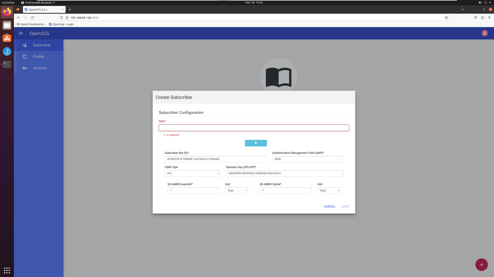
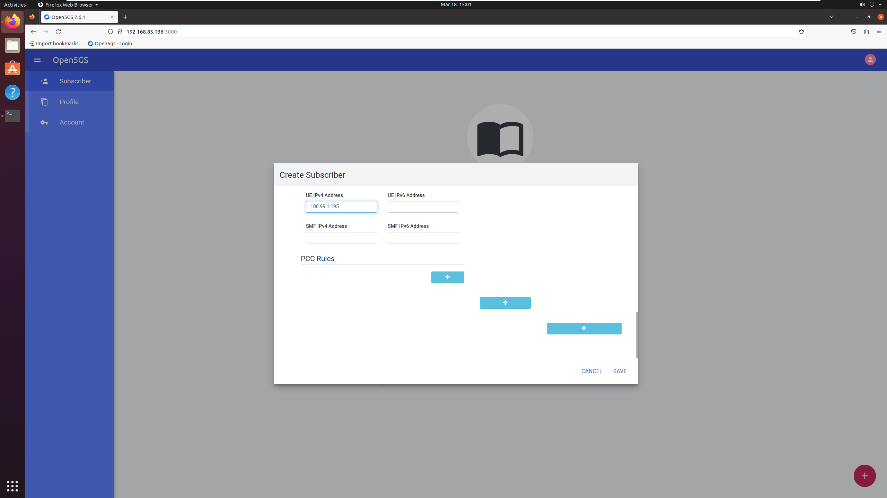

# Docker Implementation of Open5GS
## Getting Started

> Respective .OVF files can be found [here](./exports)
Make sure that you have the following VMs / Hosts setup.
1. 5G-Docker-Ubuntu
2. gNB-01-Ubuntu
3. UE01-Server

## Setup Open5GS Core Network
> Instructions to build the base image can be found [here](docker-setup.md).
### Configure the `.env` file
> The [.env](.env) file is located in the project root directory.

```bash
# Navigate to the project root directory and use your preferred text editor
cd ~/docker_open5gs
sudo nano .env

...
TEST_NETWORK=172.22.0.0/24 # Change this only if it clashes with the internal network at your home/office

DOCKER_HOST_IP=192.168.1.223 # Update with IP of the machine/VM running the open5gs containers

SGWU_ADVERTISE_IP=172.22.0.6 # Change this to value of DOCKER_HOST_IP set above only if eNB/gNB is not running the same docker network/host

UPF_ADVERTISE_IP=172.22.0.8 # Change this to value of DOCKER_HOST_IP set above only if eNB/gNB is not running the same docker network/host
...

```

### Start containers
```bash
sudo docker compose -f sa-deploy.yaml up -d
```

## Setup gNB
Refer to [UERANSIM repository](https://github.com/aligungr/UERANSIM/wiki/Installation) on instructions to install.

### Update the configuration file with your preferred text editor
> Configuration file can be located at `~/UERANSIM/config/open5g-gnb.yaml`
```bash
cd ~/UERANSIM/
nano ./config/open5gs-gnb.yaml
```

```bash
...

linkIp: 192.168.85.138 # gNB's local IP address for Radio Link Simulation (Change this to the Host IP Address)
ngapIp: 192.168.85.138 # gNB's local IP address for N2 Interface (Change this to the Host IP Address)
gtpIp: 192.168.85.138 # gNB's local IP address for N3 Interface (Change this to the Host IP Address)

...


# List of AMF address information
amfConfigs:
  - address: 172.22.0.10 # Change this to the value of DOCKER_HOST_IP
    port: 38412

...
```

### Start gNB
```bash
./build/nr-gnb -c ./config/open5gs-gnb.yaml
```

## Setup UE
### Update the configuration file with your preferred text editor
> Configuration file can be located at `~/UERANSIM/config/open5g-ue-01.yaml`
```bash
nano ./config/open5gs-ue-01.yaml

...

# IMSI number of the UE. IMSI = [MCC|MNC|MSISDN] (In total 15 digits)
supi: 'imsi-999700000000001'
# Mobile Country Code value of HPLMN
mcc: '999'
# Mobile Network Code value of HPLMN (2 or 3 digits)
mnc: '99'

...

# Permanent subscription key
key: '465B5CE8B199B49FAA5F0A2EE238A6BC'
# Operator code (OP or OPC) of the UE
op: 'E8ED289DEBA952E4283B54E88E6183CA'
# This value specifies the OP type and it can be either 'OP' or 'OPC'
opType: 'OPC'
# Authentication Management Field (AMF) value
amf: '8000'
# IMEI number of the device. It is used if no SUPI is provided
imei: '356938035643803'

...

# List of gNB IP addresses for Radio Link Simulation
gnbSearchList:
  - 127.0.0.1

...
```


### Register UE Information
Open (http://<DOCKER_HOST_IP>:3000) in a web browser, where <DOCKER_HOST_IP> is the IP of the machine/VM running the open5gs containers. Login with following credentials

```
Username : admin
Password : 1423
```
Using Web UI, add a subscriberopen5gs-ue.yaml with the information modified in the UE's configuration file
|  |  |
|---|---|

- IMSI
- Subscriber Key (K)
- Operator Key (OPc)
- UE IPv4 Address

### Start UE
```bash
cd ~/UERANSIM
./build/nr-ue -c ./config/open5gs-ue-01.yaml
```

## Authors and acknowledgment
- [@herlesupreeth](https://github.com/herlesupreeth) - [Docker Open5GS Implementation](https://github.com/herlesupreeth/docker_open5gs)
- [@open5gs](https://github.com/open5gs) - [Open5GS](https://github.com/open5gs/open5gs)
- [@aligungr](https://github.com/aligungr) - [UERANSIM](https://github.com/aligungr/UERANSIM)